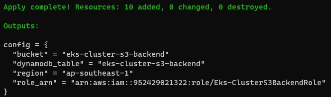

# Creating Amazon EKS (Elastic Kubernetes Service) with Terraform

Repository contains sample code that uses Terraform to create an EKS cluster and deploy the Ghost application in that EKS cluster.

Some of the goals this project accomplishes:
- Use Terraform to create an EKS cluster.
- Use Terraform to deploy Ghost applications to EKS cluster.
- Use RDS H-A architecture for the database layer of Ghost application.
- Using EFS for the storage of Ghost applications, allowing containers to use the same folder containing files.
- Implement centralized logging system using ELK stack to collect logs from Ghost application.
- Deploy a monitoring system using Grafana and Prometheus to monitor system resources.
- Test some cases after the deployment is complete, for example: auto scaling when CPU is high, fault injection simulator,...

## Table of contents
- [1. Prepare](#1-prepare)
    - [1.1 AWS CLI](#11-aws-cli)
    - [1.2 Terraform](#12-terraform)
    - [1.3 Kubernetes CLI](#13-kubernetes-cli)
- [2. Getting started](#2-getting-started)
    - [2.1 Create an S3 bucket to use as a backend for Terraform](#21-create-an-s3-bucket-to-use-as-a-backend-for-terraform)
        - [2.1.1 Move into the folder s3-backend change the required value](#211-move-into-the-folder-s3-backend-change-the-required-value)
        - [2.1.2 Create S3 bucket for Terraform backend](#212-create-s3-bucket-for-terraform-backend)
- [Software version](#software-version)


## 1. Prepare

### 1.1 AWS CLI

Follow the official guide to install and configure profiles.
- [AWS CLI Installation](https://docs.aws.amazon.com/cli/latest/userguide/cli-chap-install.html)
- [AWS CLI Configuration](https://docs.aws.amazon.com/cli/latest/userguide/cli-configure-profiles.html)

### 1.2 Terraform

To install Terraform, find the appropriate package (https://www.terraform.io/downloads.html) for your system and download it.

Also, it is recommended that you use an Ubuntu computer to install Terraform by following the commands below:

```sh
$ curl -fsSL https://apt.releases.hashicorp.com/gpg | sudo apt-key add -
$ sudo apt-add-repository "deb [arch=amd64] https://apt.releases.hashicorp.com $(lsb_release -cs) main"
$ sudo apt-get update && sudo apt-get install terraform
```

### 1.3 Kubernetes CLI

To install Kubernetes CLI, follow the instructions of this page (https://kubernetes.io/docs/tasks/tools) and if you are using Ubuntu computer follow this page (https://kubernetes.io/docs/tasks/tools/install-kubectl-linux).

## 2. Getting started

### 2.1 Create an S3 bucket to use as a backend for Terraform

In real projects, it is very dangerous to store Terraform state locally if it is lost or changed unintentionally.

Besides, it is possible to have a team with many members working with Terraform, so saving the state locally is not feasible. Members need to get the latest state of the project and be able to sync the new state to S3 every time they update the code.

So the first step before actually getting into creating the EKS cluster and deploying the applications, you need to create an S3 bucket to use as the backend for the main Terraform project.

#### 2.1.1 Move into the folder `s3-backend` change the required value

- Change the `region` value and your `project` name in the file [s3-backend/variables.tf](./s3-backend/variables.tf)

- Change the path `shared_credentials_files` to the credentials file on your computer in file [s3-backend/main.tf](./s3-backend/main.tf)

#### 2.1.2 Create S3 bucket for Terraform backend

At the `s3-backend` directory, execute the following commands in turn:

```sh
$ terraform init
$ terraform plan # This command to check if the code has any problem, it will output the changed information to the screen
$ terraform apply # Implement resource creation
```

When the `terraform apply` command finishes, you will get an information on the terminal window like the image below. Save this information and use it in the next section.



## Software version

|  Software |  Version |
|---|---|
| AWS CLI | 1.18.69 |
|  Terraform | v1.1.8 |