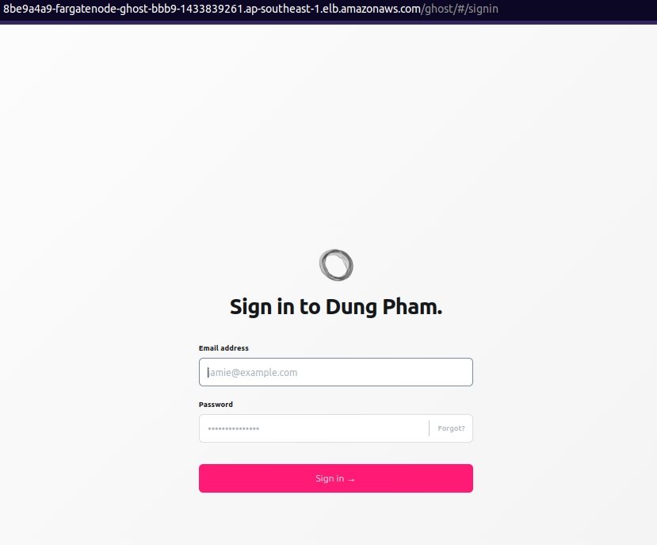

# Creating Amazon EKS (Elastic Kubernetes Service) with Terraform

Repository contains sample code that uses Terraform to create an EKS cluster and deploy the Ghost application in that EKS cluster.

Some of the goals this project accomplishes:
- Use Terraform to create an EKS cluster.
- Use Terraform to deploy Ghost applications to EKS cluster.
- Use RDS H-A architecture for the database layer of Ghost application.
- Using EFS for the storage of Ghost applications, allowing containers to use the same folder containing files.
- Implement centralized logging system using ELK stack to collect logs from Ghost application.
- Deploy a monitoring system using Grafana and Prometheus to monitor system resources.
- Test some cases after the deployment is complete, for example: auto scaling when CPU is high, fault injection simulator,...

## Table of contents
- [1. Prepare](#1-prepare)
    - [1.1 AWS CLI](#11-aws-cli)
    - [1.2 Terraform](#12-terraform)
    - [1.3 Kubernetes CLI](#13-kubernetes-cli)
- [2. Getting started](#2-getting-started)
    - [2.1 Create an S3 bucket to use as a backend for Terraform](#21-create-an-s3-bucket-to-use-as-a-backend-for-terraform)
        - [2.1.1 Move into the folder s3-backend change the required value](#211-move-into-the-folder-s3-backend-change-the-required-value)
        - [2.1.2 Create S3 bucket for Terraform backend](#212-create-s3-bucket-for-terraform-backend)
    - [2.2 Create EKS cluster and deploy Ghost application](#22-create-eks-cluster-and-deploy-ghost-application
    )
        - [2.2.1 Change the necessary values before creating the EKS cluster](#221-change-the-necessary-values-before-creating-the-eks-cluster)
        - [2.2.2 Implement Terraform to create EKS cluster and deploy Ghost application](#222-implement-terraform-to-create-eks-cluster-and-deploy-ghost-application)
        - [2.2.3 Go to the Ghost app](#223-go-to-the-ghost-app)
    - [2.3 Connect kubeclt to the newly created EKS cluster](#23-connect-kubeclt-to-the-newly-created-eks-cluster)
- [3. What has been done and checked](#3-what-has-been-done-and-checked)
- [4. More things to do](#4-more-things-to-do)
- [5. Clean everything](#5-clean-everything)
- [6. Software version](#software-version)


## 1. Prepare

### 1.1 AWS CLI

Follow the official guide to install and configure profiles.
- [AWS CLI Installation](https://docs.aws.amazon.com/cli/latest/userguide/cli-chap-install.html)
- [AWS CLI Configuration](https://docs.aws.amazon.com/cli/latest/userguide/cli-configure-profiles.html)

### 1.2 Terraform

To install Terraform, find the appropriate package (https://www.terraform.io/downloads.html) for your system and download it.

Also, it is recommended that you use an Ubuntu computer to install Terraform by following the commands below:

```sh
$ curl -fsSL https://apt.releases.hashicorp.com/gpg | sudo apt-key add -
$ sudo apt-add-repository "deb [arch=amd64] https://apt.releases.hashicorp.com $(lsb_release -cs) main"
$ sudo apt-get update && sudo apt-get install terraform
```

### 1.3 Kubernetes CLI

To install Kubernetes CLI, follow the instructions of this page (https://kubernetes.io/docs/tasks/tools) and if you are using Ubuntu computer follow this page (https://kubernetes.io/docs/tasks/tools/install-kubectl-linux).

## 2. Getting started

### 2.1 Create an S3 bucket to use as a backend for Terraform

In real projects, it is very dangerous to store Terraform state locally if it is lost or changed unintentionally.

Besides, it is possible to have a team with many members working with Terraform, so saving the state locally is not feasible. Members need to get the latest state of the project and be able to sync the new state to S3 every time they update the code.

So the first step before actually getting into creating the EKS cluster and deploying the applications, you need to create an S3 bucket to use as the backend for the main Terraform project.

#### 2.1.1 Move into the folder `s3-backend` change the required value

- Change the `region` value and your `project` name in the file [s3-backend/variables.tf](./s3-backend/variables.tf)

- Change the path `shared_credentials_files` to the credentials file on your computer in file [s3-backend/main.tf](./s3-backend/main.tf)

#### 2.1.2 Create S3 bucket for Terraform backend

At the `s3-backend` directory, execute the following commands in turn:

```sh
$ terraform init
$ terraform plan # This command to check if the code has any problem, it will output the changed information to the screen
$ terraform apply # Implement resource creation
```

When the `terraform apply` command finishes, you will get an information on the terminal window like the image below. Save this information and use it in the next section.


### 2.2 Create EKS cluster and deploy Ghost application

#### 2.2.1 Change the necessary values before creating the EKS cluster

- First, get the output values in step [2.1.2](#212-create-s3-bucket-for-terraform-backend), information about the S3 bucket for remote backend. Please replace these values in the file [backend.tf](./backend.tf)

- Next, update the path `shared_credentials_files` to the credential file in the file [main.tf](./main.tf)

- Finally, change the values to your liking in the file [terraform.tfvars](./terraform.tfvars)

#### 2.2.2 Implement Terraform to create EKS cluster and deploy Ghost application

At the main project directory, execute the following commands:

```sh
$ terraform init
$ terraform plan # This command to check if the code has any problem, it will output the changed information to the screen
$ terraform apply # Implement resource creation
```

The output of the terraform apply command should look like this:


#### 2.2.3 Go to the Ghost app

You copy the output `alb_hostname` and paste it in your browser, this is ALB's public DNS pointing to the Ghost application in the EKS cluster.


I won't go into too much detail about using Ghost, here I test it in action by simply setting up an Admin account and then creating an article called Test Post.

To set up an Admin account for the first time, go to the application's URL and add the path `/ghost`. Specifically would be: [https://8be9a4a9-fargatenode-ghost-bbb9-1433839261.ap-southeast-1.elb.amazonaws.com/ghost](https://8be9a4a9-fargatenode-ghost-bbb9-1433839261.ap-southeast-1.elb.amazonaws.com/ghost).

**`Please note that this link is for demo purposes only, I will delete it after testing is done. Please use the link on your environment`**.

Now, I can log in to the Ghost app with an Admin account.




### 2.3 Connect kubeclt to the newly created EKS cluster

Run the command below to update the configuration for kubectl:

```sh
$ aws eks --region $(terraform output -raw eks_region) update-kubeconfig --name $(terraform output -raw eks_cluster_name)
```

Check the connection with the command get node information:

```sh
$ kubectl get nodes
```

The result like this:


View pod list information:

```sh
$ kubectl get pod -A | grep Running
```


## 3. What has been done and checked

- Using S3 bucket as backend for Terraform

    Terraform's state is stored on S3, which is more secure than local storage.


    Also check the access to the public state file, make sure it's not exposed to the internet.


- Deploy successfully applied Ghost to EKS cluster through Terraform tool, using Kubernetes provider.

- Successfully created RDS Aurora engine MySQL 5.7 database and used it for Ghost application.

## 4. More things to do

- Upgrade RDS Aurora to global mode.

- Create an EFS and connect it to the Ghost application.

- Build system logging & monitoring

- Fault testing, scale testing,...

## 5. Clean everything

After you finish using the project, maybe for testing purposes, for example. You can delete all created AWS resources like this:


```sh
$ terraform destroy # Delete EKS cluster and related resources
$ cd s3-backend
$ terraform destroy # Delete the S3 bucket used for the Terraform backend
```

## 6.  Software version

|  Software |  Version |
|---|---|
| AWS CLI | 1.18.69 |
|  Terraform | 1.1.8 |
| kubectl | 1.23 |
| EKS | 1.21 |